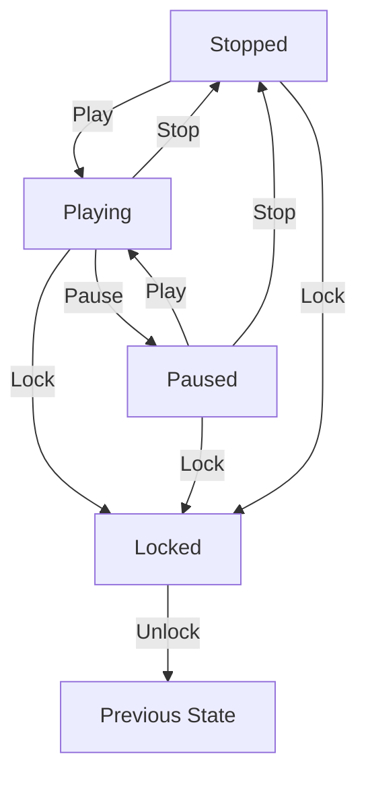

# Media Player - State Pattern Implementation

## Overview
This implementation demonstrates a real-world media player that uses the State pattern to manage different playback states and their transitions. The example shows how to handle complex state management in a modern application with features like playback control, speed adjustment, and player locking.

## Key Features

### 1. Multiple States
- **PlayingState**: Active playback with speed control
- **PausedState**: Temporarily halted playback
- **StoppedState**: Complete halt with reset progress
- **LockedState**: Protected state preventing operations

### 2. State Transitions


### 3. Advanced Features
- **Time Tracking**: Maintains current playback position
- **Playback Speed**: Adjustable speed during playback
- **State Memory**: Locked state remembers previous state
- **Async Operations**: Supports asynchronous state transitions

## Implementation Details

### State Interface
```csharp
public interface IMediaPlayerState
{
    Task Play(MediaPlayer player);
    Task Pause(MediaPlayer player);
    Task Stop(MediaPlayer player);
    Task Lock(MediaPlayer player);
    Task Speed(MediaPlayer player, double speed);
    string GetCurrentState();
}
```

### Context (MediaPlayer)
The MediaPlayer class maintains:
- Current state
- Playback timing
- Speed settings
- Player status

### Key Benefits
1. **Clean State Transitions**: Each state handles its own transitions
2. **Encapsulated Behavior**: State-specific logic is isolated
3. **Easy to Extend**: New states can be added without modifying existing code
4. **Thread-Safe**: Async operations support
5. **Rich Feature Set**: Demonstrates real-world complexity

### Usage Example
```csharp
var player = new MediaPlayer();
await player.Play();          // Starts playback
await player.Speed(1.5);      // Increases speed
await player.Lock();          // Locks controls
await player.Lock();          // Unlocks controls
await player.Pause();         // Pauses playback
await player.Stop();          // Stops playback
```

## Best Practices Demonstrated
1. **Single Responsibility**: Each state handles its own logic
2. **Open/Closed Principle**: Easy to add new states
3. **Interface Segregation**: Clear state interface
4. **Dependency Inversion**: States depend on abstractions
5. **Async/Await Pattern**: Modern asynchronous operations

## When to Use This Pattern
- Media players and streaming applications
- Process control systems
- Workflow management
- UI state management
- Game state management

## Additional Considerations
- State transitions are validated
- Invalid operations are handled gracefully
- State history is maintained (for locked state)
- Progress tracking is implemented
- Speed control is state-aware
