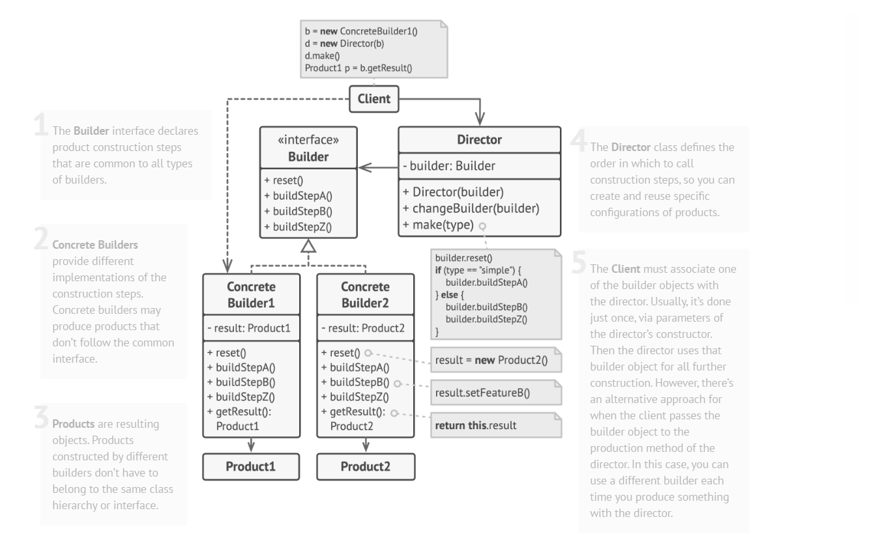

# Builder Design Pattern

Builder is a creational design pattern that lets you construct complex objects step by step. The pattern allows you to produce different types and representations of an object using the same construction code.



## Problem

Imagine you need to create a complex object like a Computer. A Computer has many components: CPU, GPU, RAM, storage, motherboard, power supply, case, and various optional features like WiFi, Bluetooth, and peripherals.

### Issues with Traditional Approaches:

1. **Telescoping Constructor**: Creating constructors with many parameters becomes unwieldy
   ```csharp
   // This becomes unmanageable and error-prone
   Computer(string cpu, string gpu, int ram, int storage, string storageType, 
            string motherboard, string powerSupply, string case, bool hasWiFi, 
            bool hasBluetooth, List<string> peripherals, decimal price)
   ```

2. **Multiple Constructors**: Creating many constructors for different combinations leads to constructor explosion

3. **Setters Everywhere**: Using setters makes the object mutable and doesn't guarantee a complete object

## Solution

The Builder pattern suggests extracting the object construction code out of its own class and move it to separate objects called builders.

### Key Components:

1. **Product (Computer)**: The complex object being built
2. **Builder Interface (IComputerBuilder)**: Defines the construction steps
3. **Concrete Builder (ComputerBuilder)**: Implements the construction steps
4. **Director (ComputerDirector)**: Defines the order of construction steps for common configurations

## Real-World Example: Computer Configuration System

Our example demonstrates building different types of computers:

- **Office Computer**: Basic configuration for office work
- **Gaming Computer**: High-performance setup for gaming
- **Budget Computer**: Cost-effective configuration
- **Workstation Computer**: Professional setup for content creation
- **Custom Computer**: User-defined configuration

### Benefits Demonstrated:

1. **Step-by-step Construction**: Build computers component by component
2. **Method Chaining**: Fluent interface for easy configuration
3. **Reusability**: Same builder can create different computer types
4. **Encapsulation**: Director encapsulates common build algorithms
5. **Flexibility**: Easy to add new components without changing existing code
6. **Immutability**: Final product is complete and consistent

## When to Use Builder Pattern

✅ **Use Builder when:**
- Creating complex objects with many optional parameters
- The construction process must allow different representations
- You want to construct objects step by step
- The construction process is complex and should be isolated

❌ **Don't use Builder when:**
- The object is simple with few parameters
- The construction process is straightforward
- You don't need different representations of the object

## How to Implement

1. Make sure that you can clearly define the common construction steps for building all available product representations.

2. Declare these steps in the base builder interface.

3. Create a concrete builder class for each of the product representations and implement their construction steps.
   Don't forget about implementing a method for fetching the result of the construction.

4. Think about creating a director class. It may encapsulate various ways to construct a product using the same builder object.

5. The client code creates both the builder and the director objects. Before construction starts, the client must pass a builder object to the director.

## Code Structure

```
Builder/
├── Computer.cs              # Product class
├── IComputerBuilder.cs      # Builder interface
├── ComputerBuilder.cs       # Concrete builder implementation
├── ComputerDirector.cs      # Director for common configurations
└── BuilderExample.cs        # Usage examples
```

## Running the Example

The example demonstrates various ways to build computers and shows how the Builder pattern solves the complexity of object construction while maintaining flexibility and readability.

### Example Usage:

```csharp
// Using Director for predefined configurations
var builder = new ComputerBuilder();
var director = new ComputerDirector(builder);
var gamingComputer = director.BuildGamingComputer();

// Using Builder directly for custom configurations
var customComputer = new ComputerBuilder()
    .SetCPU("Intel Core i7-13700K", 400m)
    .SetGPU("AMD RX 7800 XT", 500m)
    .SetRAM(32, 9m)
    .SetStorage(1000, "NVMe SSD", 120m)
    .AddWiFi()
    .AddBluetooth()
    .Build();
```

This example shows how the Builder pattern solves real-world problems of complex object construction while maintaining clean, readable, and maintainable code.
